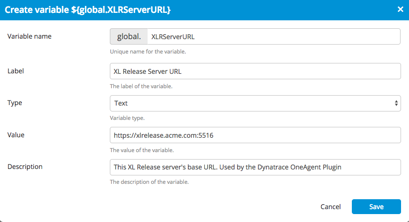
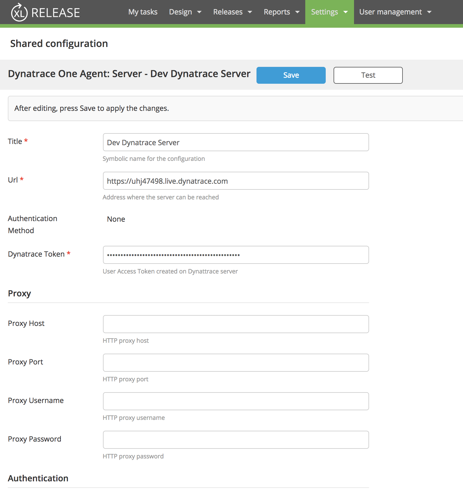
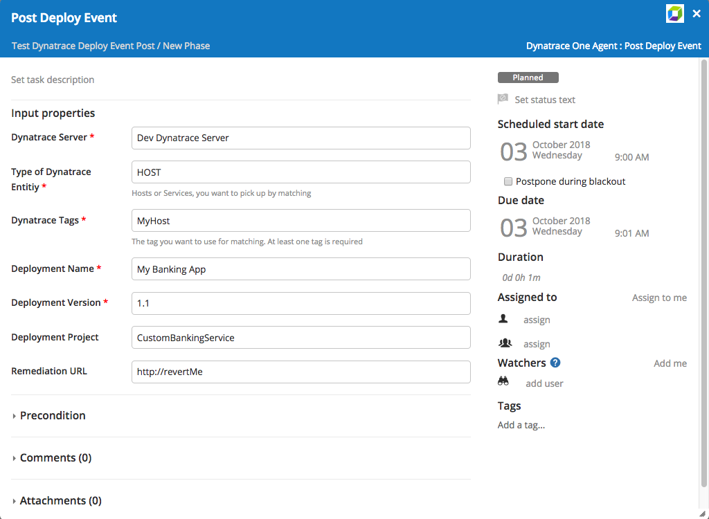
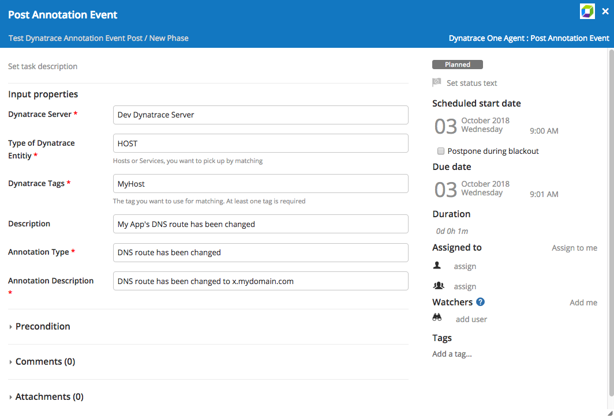
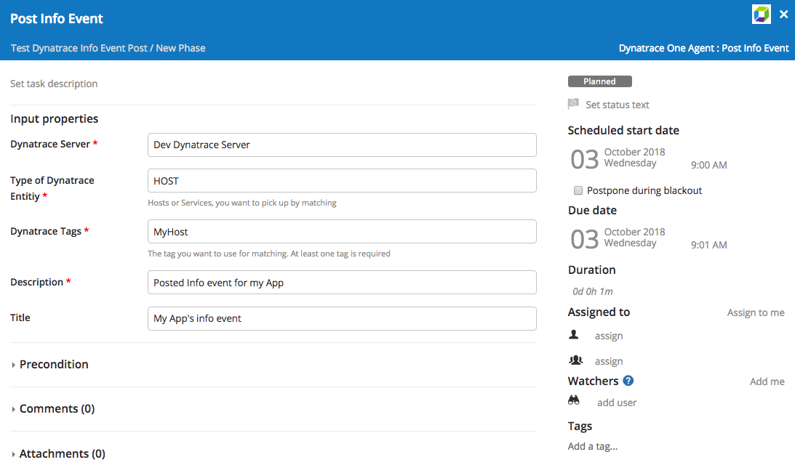

##XL Release Dynatrace OneAgent Plugin
Note:  this plugin is for Dynatrace OneAgent If you require [Dynatrace AppMon](https://github.com/xebialabs-community/xlr-dynatrace-plugin) please use this link.

## Preface
This document descripts the functionality provide by the `xlr-dynatrace-oneagent-plugin`, as well as potential future functionality.

## Overview
In addition to being a monitoring tool, Dynatrace can be used to collect data during testing. This plugin allows users to query Dynatrace's enhanced test results from XL Release to make decisions about whether or not to continue with a release.

## Requirements
* Requirements
    * XL Release 7.5.3+
    
* Remarks
    * Version 1.x includes Shared configuration for connecting to the Dynatrace server and 3 tasks for posting events (Deployment, Annotation & Info) to the Dynatrace server.

## Installation
1. Place the plugin JAR file into your SERVER_HOME/plugins directory.
1. Restart the XL Release server

## Plugin Configuration
1. Create a Global variable to hold  the XL Release Server URL (Pre 8.5).
1. Add a Dynatrace OneAgent Server configuration in the Shared Configuration view.

The plugin requires the following configuration (steps from above):
* Under **Settings -> Global vairables** Create a new global variable called **XLRServerURL** to contain the server URL that should be used to access XL Release. For example.  https://xlrelease.acme.com:5516

* Under **Settings -> Shared Configuration** menu, add a Dynatrace server

**Input properties**

* `title`: The symbolic name of this Dynatrace server. _Required_
* `url`: URL for this Dynatrace server. _Optional_
* `authenticationMehtod`: Select authentication method, Whn using access tocken select **"None"**. _Optional_
* `dynatraceToken`: User Access Token created on the Dynatrace server. _Required_
* `dynatraceEventApiUrl`: Event API URL for Dynattrace server. Examples below. _Required_
    * Managed: **/e/{your-environment-id}/api/v1/events** 
    * SaaS: **/api/v1/events** 
* `deploymentProject`: The project name of the deployed package. _Optional_
* `remediationUrl`: The link to the deployment related remediation action within the external deployment tool. _Optional_

## Supported Tasks
The plugin currently supports five tasks:

* [Post Deployment Event](https://www.dynatrace.com/support/help/shortlink/api-events#post-events)
* [Post Annotation Event](https://www.dynatrace.com/support/help/shortlink/api-events#post-events)
* [Post Info Event](https://www.dynatrace.com/support/help/shortlink/api-events#post-events)

#### Post Deployment Event Task

Posts a deployment event to the Dynatrace server.

**Input properties**

* `dynatraceServer`: The Dynatrace server with which the test run should be registered. _Required_
* `meType`: Used by the TagRule Object. The type of the Dynatrace entities, for example hosts or services, you want to pick up by matching. _Optional_
* `customTags`: Used by the TagRule Object. The Dynatrace tag you want to use for matching. At least one tag is required. _Required_
* `deploymentName`: The ID or the name of the triggered deployment. _Required_
* `deploymentVersion`: The version of the triggered deployment. _Required_
* `deploymentProject`: The project name of the deployed package. _Optional_
* `remediationUrl`: The link to the deployment related remediation action within the external deployment tool. _Optional_

**Output properties**

* None

#### Post Annotation Event Task

Posts a annotation event to the Dynatrace server.

**Input properties**

* `dynatraceServer`: The Dynatrace server with which the test run should be registered. _Required_
* `meType`: Used by the TagRule Object. The type of the Dynatrace entities, for example hosts or services, you want to pick up by matching. _Optional_
* `customTags`: Used by the TagRule Object. The Dynatrace tag you want to use for matching. At least one tag is required. _Required_
* `description`: The textual description of the configuration change. _Optional_
* `annotationType`: The type of the custom annotation, for example DNS route has been changed. _Required_
* `annotationDescription`: The detailed description of the custom annotation, for example DNS route has been changed to x.mydomain.com. _Required_

**Output properties**

* None

#### Post Info Event Task

Posts a info event to the Dynatrace server.

**Input properties**

* `dynatraceServer`: The Dynatrace server with which the test run should be registered. _Required_
* `meType`: Used by the TagRule Object. The type of the Dynatrace entities, for example hosts or services, you want to pick up by matching. _Optional_
* `customTags`: Used by the TagRule Object. The Dynatrace tag you want to use for matching. At least one tag is required. _Required_
* `description`: The textual description of the configuration change. _Required_
* `title`: The title of the configuration that has been set by the event. _Optional_

**Output properties**

* None

#### Retrieve Test Results

TBD version 2.x
